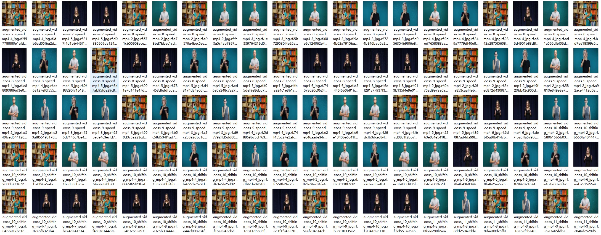
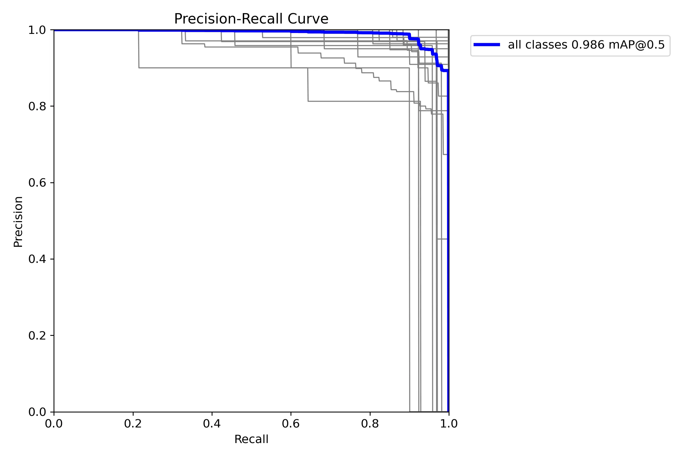
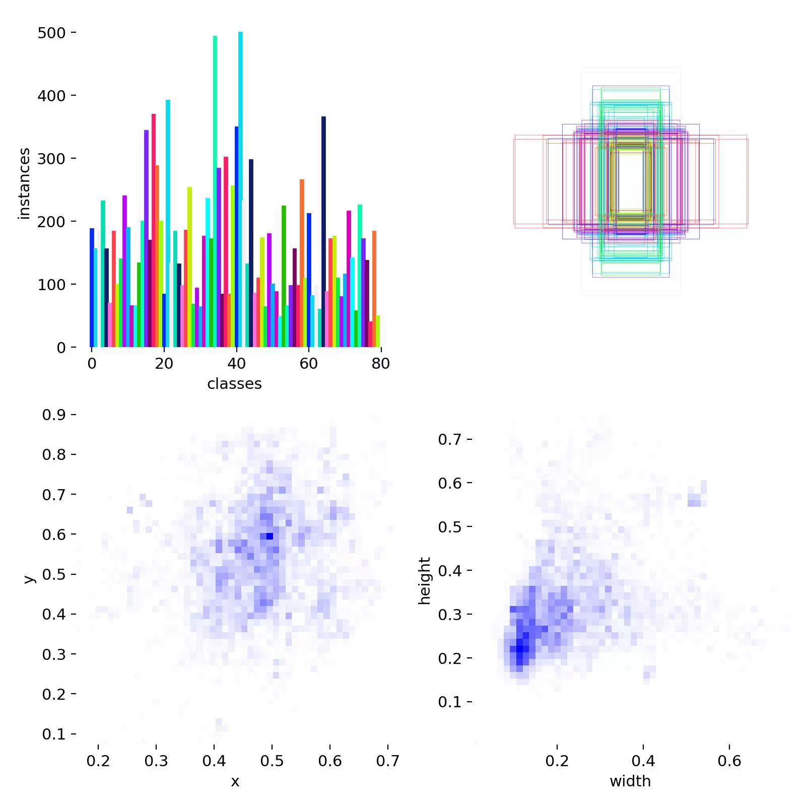
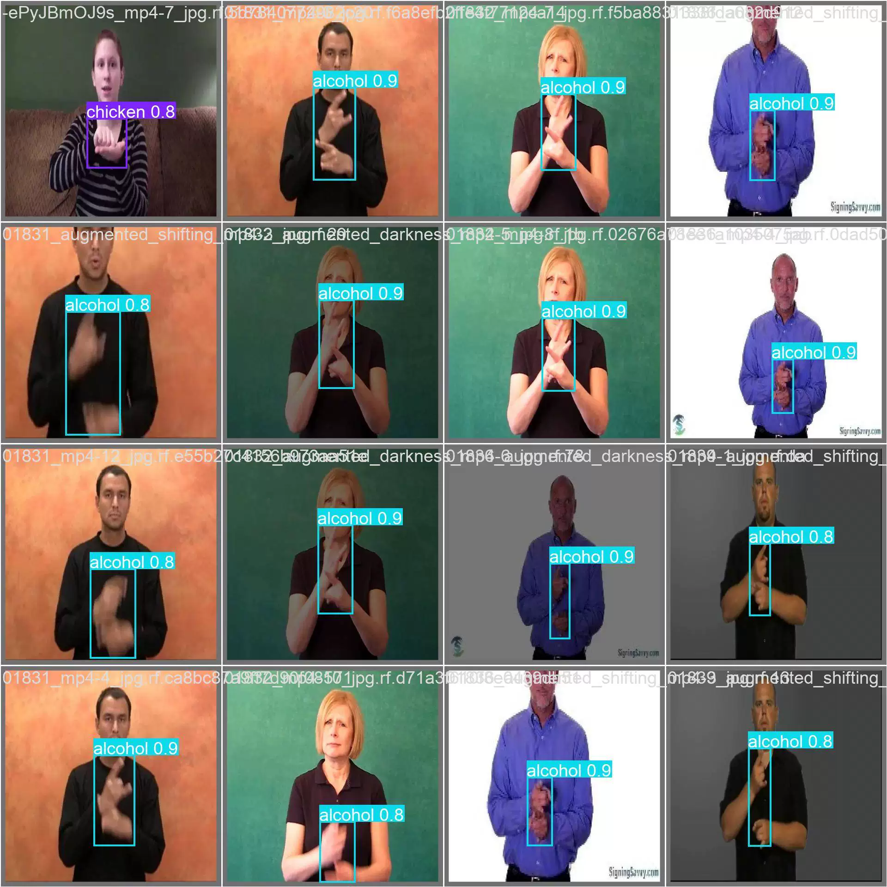
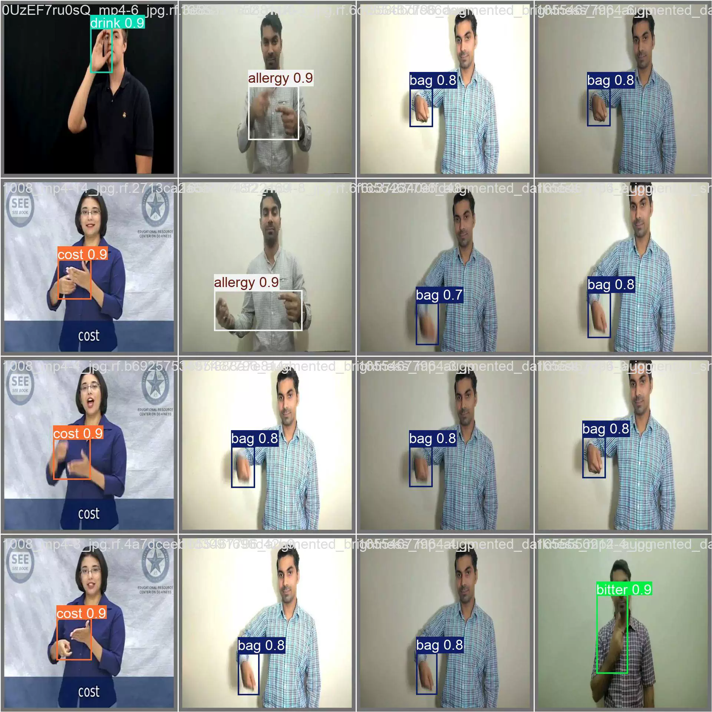
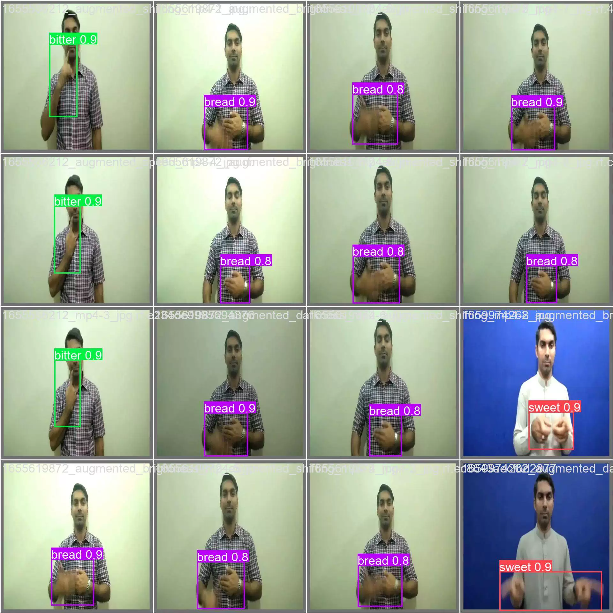
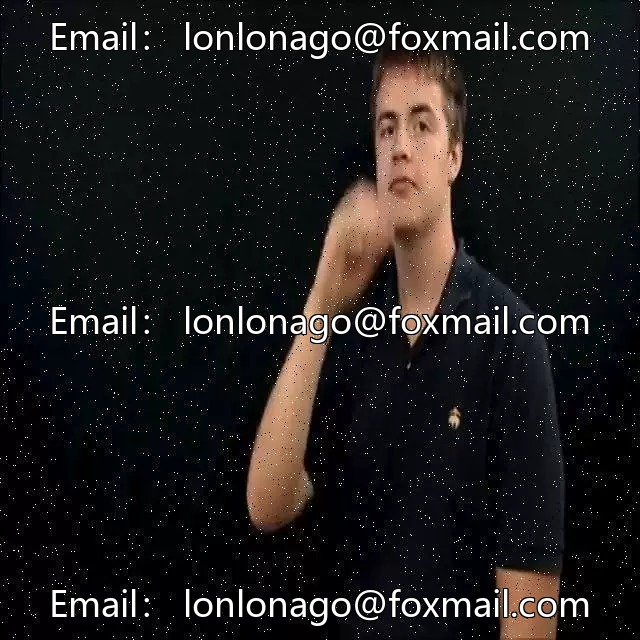

## Body

Blind Man Gesture Recognition Detection Dataset in YOLO format

Totally 16,536 images, each labeled and divided into train (13,584), valid (1,913), test (1,039).

Divided into 80 classes, including: 'additional', 'alcohol', 'allergy', 'bacon', 'bag', 'barbecue', 'bill', 'biscuit', 'bitter', 'bread', 'burger', 'bye', 'cake', 'cash', 'cheese', 'chicken', 'coke', 'cold', 'cost', 'coupon', 'credit card', 'cup', 'dessert', 'drink', 'drive', 'eat', 'eggs', 'enjoy', 'fork', 'french fries', 'fresh', 'hello', 'hot', 'icecream', 'ingredients', 'juicy', 'ketchup', 'lactose', 'lettuce', 'lid', 'manager', 'menu', 'milk', 'mustard', 'napkin', 'no', 'order', 'pepper', 'pickle', 'pizza', 'please', 'ready', 'receipt', 'refill', 'repeat', 'safe', 'salt', 'sandwich', 'sauce', 'small', 'soda', 'sorry', 'spicy', 'spoon', 'straw', 'sugar', 'sweet', 'thank-you', 'tissues', 'tomato', 'total', 'urgent', 'vegetables', 'wait', 'warm', 'water', 'what', 'would', 'yoghurt', 'your'.

YOLOv8s target detection weights file (Training rounds 100, pre-trained model YOLOv8s.pt, mAP@0.5 0.986) with training results file

## Images

item_1063658896504

Here is a pay link on Stripe ( https://buy.stripe.com/3cs8yP7sY87d0vu9AB ). Please contact me lonlonago@foxmail.com after funding $89, and I will send you a complete data files , thank you!

